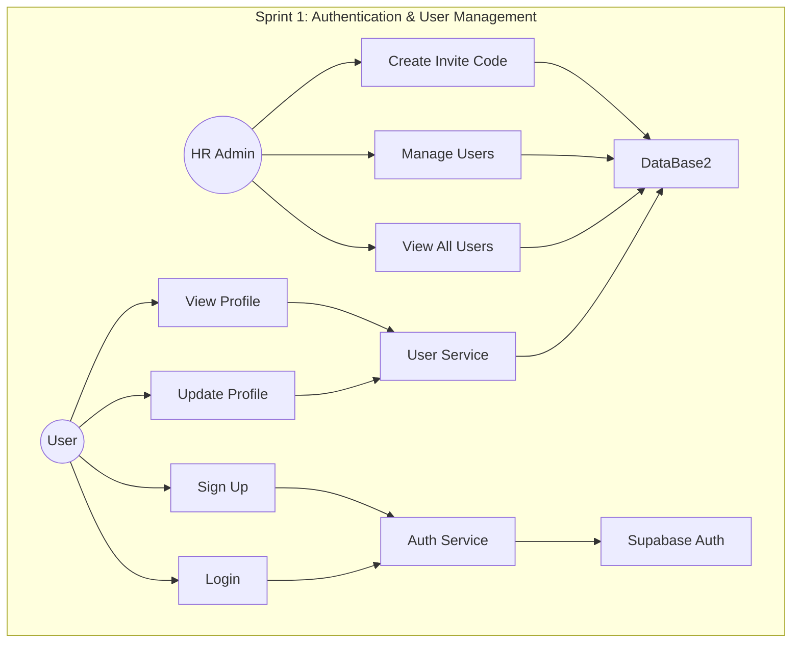
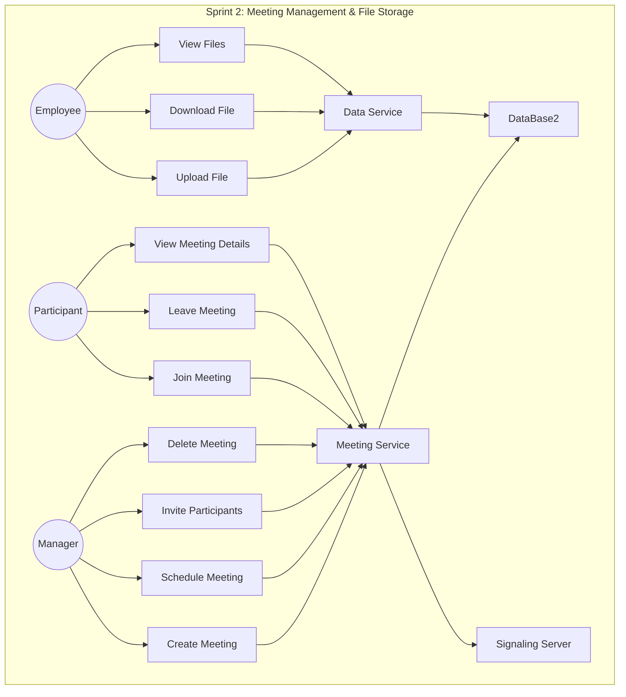
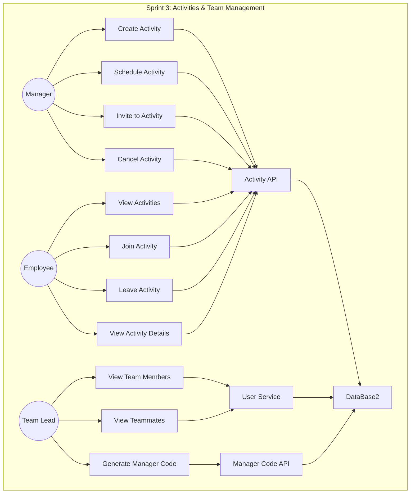
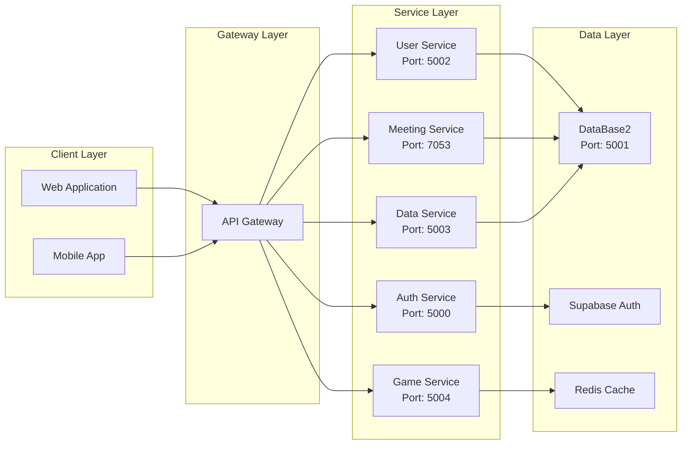

# Use Case Diagrams - Server & DataBase2

## Sprint 1: Authentication & User Management

### Actors
- **User** (Employee/Manager)
- **HR Admin**
- **System**

### Use Cases

**Detailed Use Cases:**

1. **Sign Up**
   - Actor: User
   - Description: User creates account using invite code
   - Services: authService, userServices, DataBase2
   - Endpoints: `POST /auth/signup`, `POST /users/`

2. **Login**
   - Actor: User
   - Description: User authenticates with credentials
   - Services: authService
   - Endpoints: `POST /auth/login`

3. **View Profile**
   - Actor: User
   - Description: User views their profile information
   - Services: userServices, DataBase2
   - Endpoints: `GET /users/{email}`

4. **Update Profile**
   - Actor: User
   - Description: User updates profile details
   - Services: userServices, DataBase2
   - Endpoints: `PUT /users/{email}`

5. **Create Invite Code**
   - Actor: HR Admin
   - Description: Generate invite codes for new employees
   - Services: DataBase2
   - Endpoints: `POST /invites/`

6. **Manage Users**
   - Actor: HR Admin
   - Description: View and manage user accounts
   - Services: userServices, DataBase2
   - Endpoints: `GET /users/`, `DELETE /users/{email}`

---

## Sprint 2: Meeting Management & File Storage

### Actors
- **Manager**
- **Employee**
- **Meeting Participant**

### Use Cases

**Detailed Use Cases:**

8. **Create Meeting**
   - Actor: Manager
   - Description: Create new meeting with title and description
   - Services: meetingService, DataBase2
   - Endpoints: `POST /meetings/`

9. **Schedule Meeting**
   - Actor: Manager
   - Description: Set meeting date and time
   - Services: meetingService, DataBase2
   - Endpoints: `PUT /meetings/{meeting_id}`

10. **Invite Participants**
    - Actor: Manager
    - Description: Add employees to meeting
    - Services: meetingService, DataBase2
    - Endpoints: `POST /meetings/{meeting_id}/add-user`

11. **Delete Meeting**
    - Actor: Manager
    - Description: Cancel/delete meeting
    - Services: meetingService, DataBase2
    - Endpoints: `DELETE /meetings/{meeting_id}`

12. **Join Meeting**
    - Actor: Participant
    - Description: Join active meeting via WebSocket
    - Services: meetingService, Signaling Server
    - Events: `join-room`, `offer`, `answer`

13. **Leave Meeting**
    - Actor: Participant
    - Description: Exit meeting
    - Services: meetingService
    - Events: `leave-room`, `disconnect`

14. **View Meeting Details**
    - Actor: Participant
    - Description: View meeting information
    - Services: meetingService, DataBase2
    - Endpoints: `GET /meetings/{meeting_id}`

15. **Upload File**
    - Actor: Employee
    - Description: Upload document to system
    - Services: dataService, DataBase2
    - Endpoints: `POST /file/upload`

16. **Download File**
    - Actor: Employee
    - Description: Download stored file
    - Services: dataService, DataBase2
    - Endpoints: `GET /file/get/{filename}`

17. **View Files**
    - Actor: Employee
    - Description: List all uploaded files
    - Services: dataService, DataBase2
    - Endpoints: `GET /file/getAll`

---

## Sprint 3: Activities & Team Management

### Actors
- **Manager**
- **Employee**
- **Team Lead**

### Use Cases

**Detailed Use Cases:**

18. **Create Activity**
    - Actor: Manager
    - Description: Create new team activity
    - Services: DataBase2 (activities API)
    - Endpoints: `POST /activities/`

19. **Schedule Activity**
    - Actor: Manager
    - Description: Set activity date and type
    - Services: DataBase2 (activities API)
    - Endpoints: `PUT /activities/{activity_id}`

20. **Invite to Activity**
    - Actor: Manager
    - Description: Add employees to activity
    - Services: DataBase2 (activities API)
    - Endpoints: `POST /activities/{activity_id}/add-employee`

21. **Cancel Activity**
    - Actor: Manager
    - Description: Delete activity
    - Services: DataBase2 (activities API)
    - Endpoints: `DELETE /activities/{activity_id}`

22. **View Activities**
    - Actor: Employee
    - Description: List all activities
    - Services: DataBase2 (activities API)
    - Endpoints: `GET /activities/`

23. **Join Activity**
    - Actor: Employee
    - Description: Register for activity
    - Services: DataBase2 (activities API)
    - Endpoints: `POST /activities/{activity_id}/add-employee`

24. **Leave Activity**
    - Actor: Employee
    - Description: Unregister from activity
    - Services: DataBase2 (activities API)
    - Endpoints: `POST /activities/{activity_id}/remove-employee`

25. **View Activity Details**
    - Actor: Employee
    - Description: View activity information
    - Services: DataBase2 (activities API)
    - Endpoints: `GET /activities/{activity_id}`

26. **View Team Members**
    - Actor: Team Lead
    - Description: View employees under management
    - Services: userServices, DataBase2
    - Endpoints: `GET /users/teammates/{manager_email}`

27. **Generate Manager Code**
    - Actor: Team Lead
    - Description: Create invite code for team
    - Services: DataBase2 (manager_codes API)
    - Endpoints: `POST /manager_codes/generate`

28. **View Teammates**
    - Actor: Team Lead
    - Description: List team members
    - Services: userServices, DataBase2
    - Endpoints: `GET /users/teammates/{manager_email}`

---

## System Architecture Overview

---

## Summary

### Sprint 1 (7 Use Cases)
- Authentication (2)
- User Management (5)

### Sprint 2 (10 Use Cases)
- Meeting Management (7)
- File Storage (3)

### Sprint 3 (11 Use Cases)
- Activity Management (8)
- Team Management (3)

**Total: 28 Use Cases** across 3 sprints covering Server and DataBase2 functionality.
